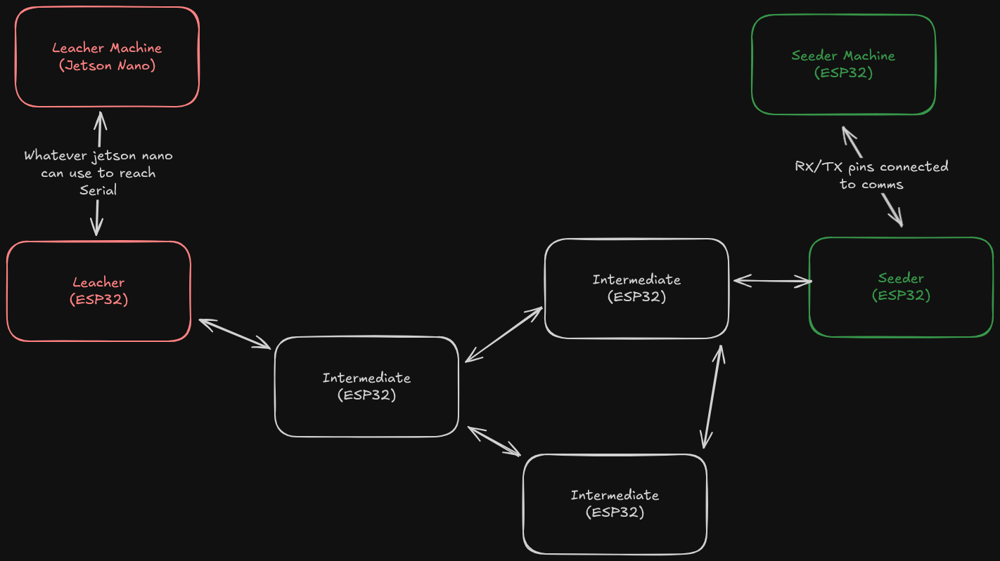
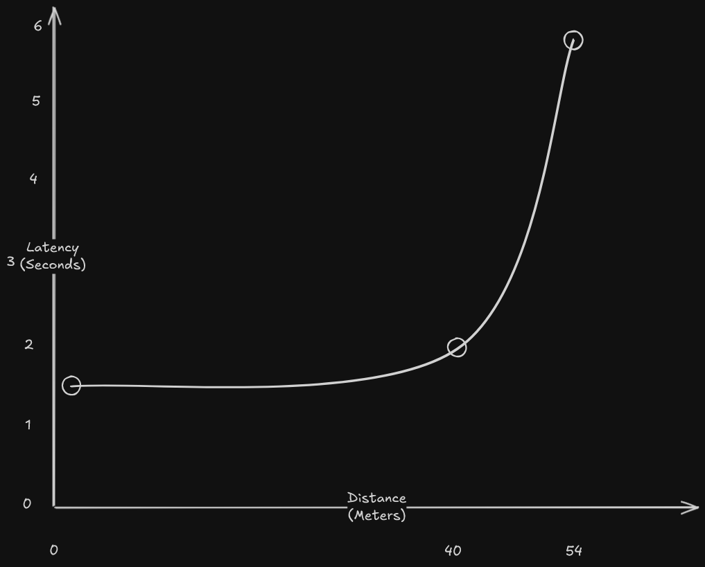

# Sat Robot Mesh Network

This is a ESP32 Code for a mesh network designed to provide the SAT Robot
(built by PLEX) with continuous internet access in spots without internet

The mesh latency scales with distance, the following graph is without any interference

The best option was 2 second latency at 40m

# Uploading code
Before doing anything, check on which port is the esp connected to, if it is something other than COM3, then either
- use global find and replace all COM3 with your port
- or update it in leacher.py, monitor.py and platformio.ini (don't worry, the scripts have it close to the top of the file)

## Intermediate Node
Practically wiring
- Run the nonseeder.bat on a connected ESP32.
- It will be an Intermediate node now.

## Leacher Mode
Will listen on the serial port for input, broadcast the requests and send responses back to serial
- Run the nonseeder.bat on a connected ESP32.
- Run leacher.py
- Send requests to port 54549 socket connection (take a look at app/test_leacher_machine.py for an example)

## Seeder Mode
The seeder will listen to the mesh for requests and forward them to seeder machine
- Run the seeder.bat on a connected ESP32.
- It will be an Seeder node now.

## Seeder Machine Mode
NOTE: before running seeder_machine.bat make sure you update the wifi and password for the region where you will put the seeder

The seeder machine will blink the inbuilt LED on startup when it is trying
to connect to the wifi. And when it connects, the LED will glow continuously.
If it disconnects in between it LED will stop.
- Run the seeder_machine.bat on a connected ESP32.
- It will be an Seeder Machine now.